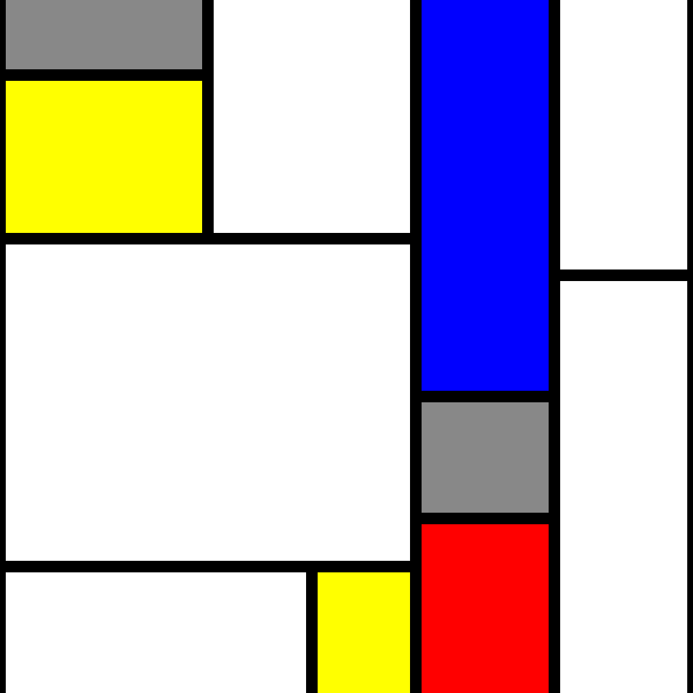

# mondrian-generator
Randomly generated art a-la Piet Mondrian



## Usage

To build a standalone APK/IPA package for Android/iOS:

### Prerequisites

* Create an account at [expo.io](https://expo.io/signup).
* Install expo-cli `yarn global add expo-cli`
* Login to the expo-cli `expo login`

### Build

```
git clone https://github.com/bgrabow/mondrian-generator.git
cd mondrian-generator
yarn install
expo build:<android/ios>
```

Then follow instructions to download the package from [expo.io](https://expo.io).

## License

Copyright © 2019 Ben Grabow

Distributed under the Eclipse Public License either version 1.0 or (at
your option) any later version.
